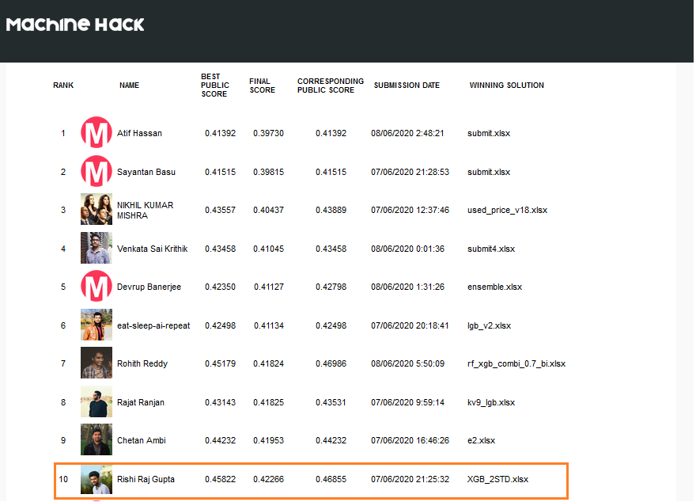

# MachineHack-Used Electronics Price Prediction: Weekend Hackathon #7

We live in a world that is driven by technology and electronic devices as gadgets have become a part of our daily life. It is near impossible to think of a world without smartphones or tablets. Like many kinds of goods or products, used electronic devices have a good demand in our country. In this hackathon, we challenge the data science community to predict the price of used electronic devices based on certain factors.

Given are 6 distinguishing factors that can influence the price of a used device. Your objective as a data scientist is to build a machine learning model that can predict the price of used electronic devices based on the given factors.
Data Description:-

The unzipped folder will have the following files.

    Train.csv –  2326 observations.
    Test.csv –  997 observations.
    Sample Submission – Sample format for the submission.

Target Variable: Price

# Evaluation
The leaderboard is evaluated using RMSLE for the participant’s submission.

# Leaderboard
## Secured rank - 10th

